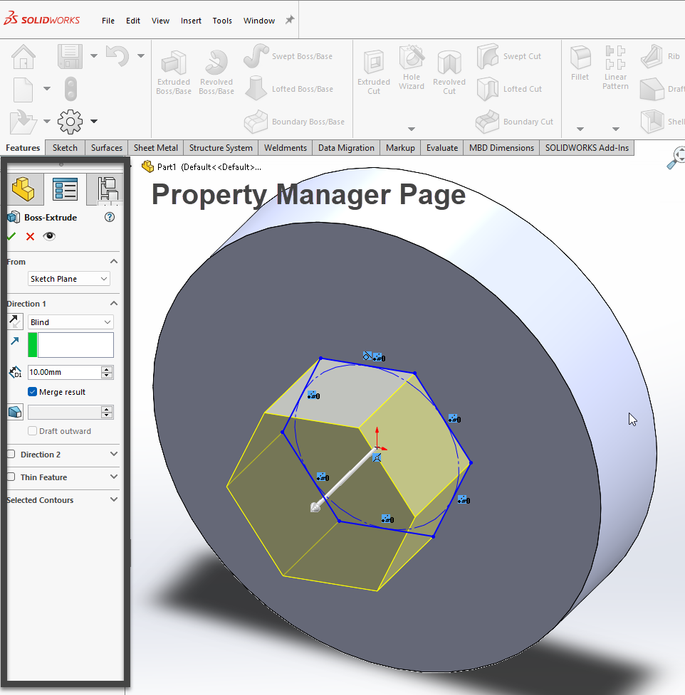
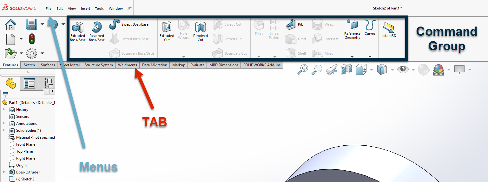

# Overview
Solidworks is knows to be easy to use. On the one hand, it is a feature-rich software that has a solution for most users requirements. On the other hand, it has a powerful UI to deliver those features. This package is focused on the UI side of things. It allows you create native looking addins for solidworks easily.

## The Issue with Solidworks API 
 Solidworks API is well documented by [Dassault Systems](https://help.solidworks.com/2020/english/api/sldworksapiprogguide/Welcome.htm). But since it uses COM you should use primitive types like `string` to interact with it. For example there is no `Bitmap` object, you should format, resize and save the image following strict regulations and pass the file path to solidworks.
 
 Fortunately `Hymma.Solidworks.Addins` wraps solidworks API functions in a proper object. To put it other words, it acts as a proxy between your code and solidworks API. It uses `.NET Framework` objects and `events`. In the example above, you would use a `Bitmap` object and the framework will format, resize and save the image and pass the address to solidworks.
 > _Note_ 
 `Hymma.Solidworks.Addins` uses `%localappdata%` as the main folder for saving and accessing files.
## Addin UIs
Solidworks API names particular sections of the UI and we have stick to that naming convention. Below you can see some of the main (most used) UI elements in a Solidworks addin.
### Terminology :unamused:
#### Command
It is a button in one of the menu bars or the tab bar. It sends a signal to Solidworks to start a `Feature`. `Commands` are housed in the `Command Group` which in turn is in a `Tab` and(or) `Menu` item.

#### Feature
When users create a 3D object, cut from it or modify it in any form they have used a feature.

#### Property Manager Page
Each feature in solidworks has its own `Property Manager Page`. A `Property Manager Page` hosts UI elements that allow users to define the feature. _For example_ when user clicks on the `Hole` button a property manager page will pop up on the left side of the screen. And they define the diameter and depth of the `Hole`.





## Quick Start
### Create and register the addin 
1. In [Visual Studio](https://visualstudio.microsoft.com/vs/community/) create a new `Class Library` targeting `.Net Framework 4.7.2` or `.NET Framework 4.8`. **You should run Visual Studio as Admin**.
2. Rename `Class1` to something meaningfull. (Optional)
3. Right-click on your project file > `Manage Nuget Packages` > Install `Hymma.Solidworks.Addins`. Version starts with the version of solidworks. (i.e. nuget package version 2018.x.xxx targets solidworks version 2018 and newer)
4. Right-click on your project file > Properties > Debug > Start External Program > `C:\Program Files\SOLIDWORKS Corp\SOLIDWORKS\SLDWORKS.exe.` (Or wherever your solidworks exe is located)
5. While in your project properties > Build > Check `Register For COM Interop` > Platform Target `Any CPU`
6. While in your project properties > Signing > from the drop down on the bottom (Choose a strong name key file) > New > Assign a name and ok 
5. Add below `Attrubutes` to you main class
```CSharp
[Addin("Title_Of_Your_Addin", AddinIcon = "addin_icon.png (Or addin_icon if using resx)", Description = "Description_For_Addin", LoadAtStartup = true)]
[Guid("C69637E8-D32E-4C73-A3F6-5DB5DD70E0EF")]
[ComVisible(true)]
```
>To Create a GUID go to `Tools` menu in `Visual Studio` select `Create Guid` then select the `5th` item and press the `Copy button` and exit.

>AddinIcon is the name of the image that is either marked as **Embedded Resource** or is added to your project using `Resources` section of your project properties window. If you decided to use an embedded resource you must provide the extension otherwise just the name of the file will suffice.
6. Inherit from `AddinMaker` > `Ctrl+.` on your class and `Impliment abstract class`

At this stage you could build your project and register the addin to COM. To confirm that >`Win key + R` > `Regedit` > browse to `'HKEY_LOCAL_MACHINE\SOFTWARE\SolidWorks\AddIns'` and you should find a folder with named with the guid value you provided.
 > Alternatively you could run this code in powershell `dir -Path 'HKLM:\SOFTWARE\SolidWorks\AddIns'`

 ### Add UI elements to your addin
 Once you implemented the abstract `AddinMaker` into your class, you can define the UI object in `public override AddinUserInterface GetUserInterFace()`. 

 We strongly recommend you clone this repo and open the project and then browse to `QRify` project. This project uses the `Hymma.Solidworks.Addins` to make a sample addin. It is heavily commented and demostrates how UI elements are defined.
Additionally, we have created an SVG file of the *PlantUML* diagrams for all the types in this package. You can find instructions under the `classDiagrams` folder :open_file_folder: to eaither re-compile them or simply download the file.
